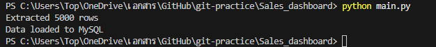
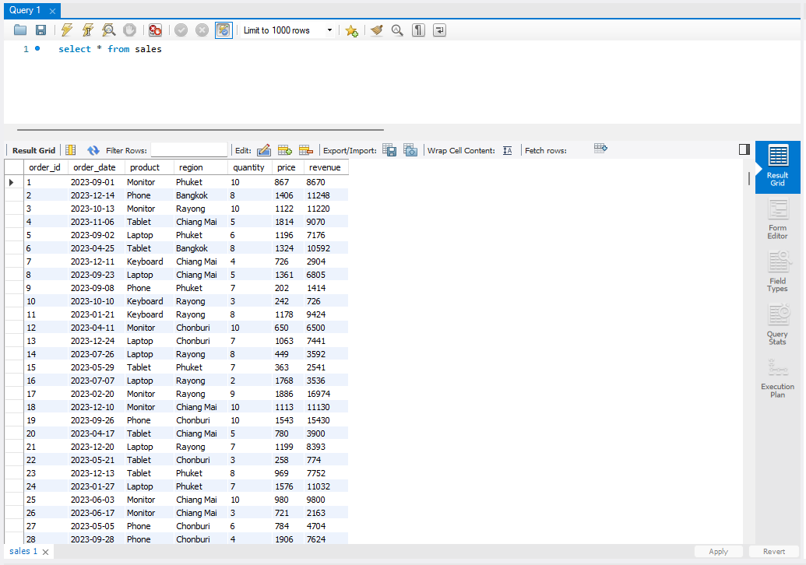

## 🚀 Key Highlights
- Built end-to-end ETL data pipeline (Python + MySQL)
- Processed 5,000+ records with validation checks
- Implemented data quality rules and logging system
- Designed for real-world analytics and reporting

Overview:
This project demonstrates an end-to-end data pipeline that ingests raw sales data, performs data transformation and validation, and loads it into a relational database for analytics and reporting.

The pipeline is designed to simulate real-world data engineering workflows, including data ingestion, ETL processing, data quality checks, and visualization.

Architecture:
Raw Data (CSV / API) 
↓ 
Extract (Python) 
↓ 
Transform (Pandas) 
↓ 
Data Validation 
↓ 
Load (MySQL) 
↓ 
Power BI Dashboard

Tech Stack:
Python (Pandas, MySQL Connector)
SQL (MySQL)
Power BI
Git

Pipeline Workflow:
1. Extract
Load raw sales data from CSV file
Simulate data ingestion from external sources
2. Transform
Clean missing values
Standardize data formats
Calculate key metrics (Revenue, Total Sales)
3. Validate
Check for null values
Validate data types
Detect duplicate records
Ensure business rules (e.g., no negative sales)
4. Load
Store processed data into MySQL database
Optimize table structure for analytics queries

Dashboard:
Power BI dashboard provides:

Total revenue overview
Sales trends over time
Top-performing products
Regional analysis

Project Structure:
data/ → Raw dataset 
pipeline/ → ETL scripts 
sql/ → Database schema 
dashboard/ → Power BI dashboard

How to Run:
pip install -r requirements.txt 
python main.py

Key Features:
End-to-end ETL pipeline
Data validation and quality checks
Scalable structure for future enhancements
Ready for real-world data integration

Future Improvements:
Integrate with real API data sources
Add Airflow for orchestration
Deploy pipeline to cloud (AWS / GCP)

## ✅ Pipeline Execution Result
Extracted 5000 rows and Validation passed

Data loaded to MySQL

Author:
Weeraphong Kingphetsareechon
Data Engineer (Aspiring)